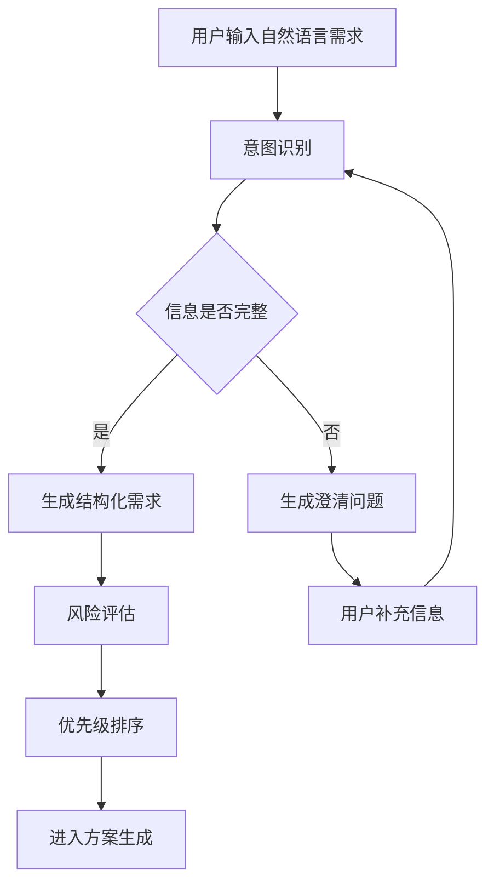
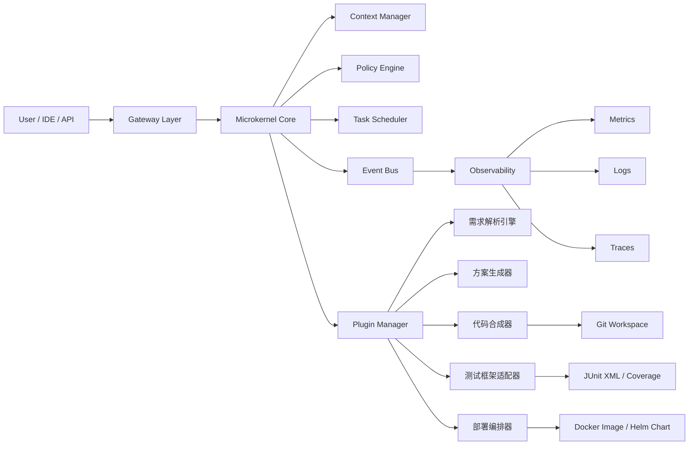
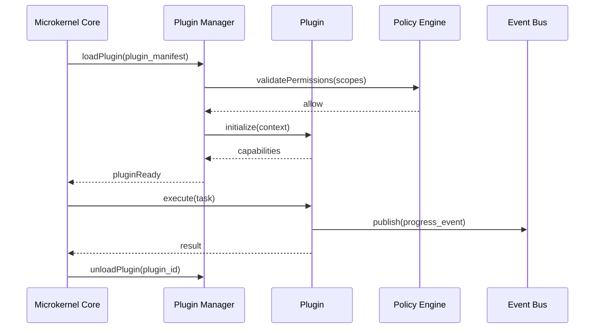
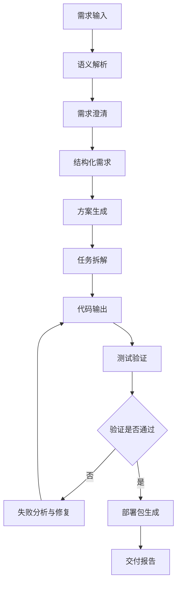
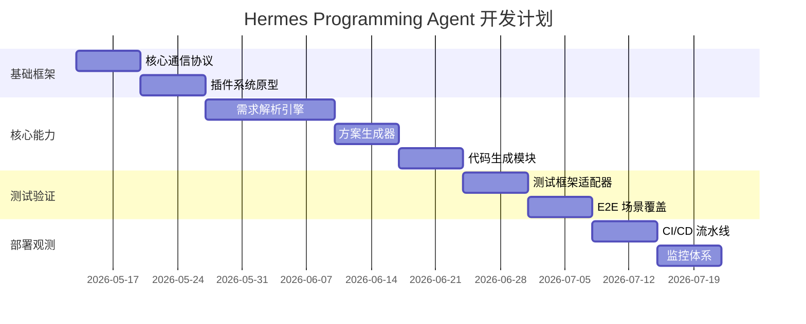
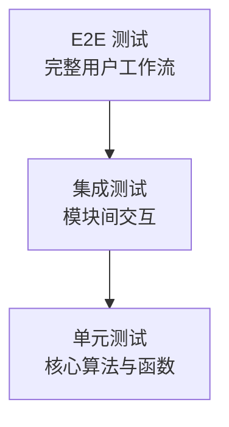

## 1. 文档摘要

<callout emoji="💡" background-color="light-blue" border-color="blue">
本方案定义 Hermes Agent 的编程子 Agent 能力建设路径，目标是构建一个具备需求理解、方案生成、代码合成、测试验证、部署编排和持续反馈能力的全生命周期编程 Agent。
</callout>

### 1.1 建设目标

| 目标 | 说明 | 衡量指标 |
|---|---|---|
| 需求理解自动化 | 支持自然语言、多轮澄清、结构化需求抽取 | 需求解析成功率 ≥ 90% |
| 技术方案自动生成 | 根据业务目标、技术约束和依赖关系生成方案 | 方案一次通过率 ≥ 80% |
| 代码合成可控 | 生成符合仓库规范、可测试、可回滚的代码 | 自动生成代码可编译率 ≥ 95% |
| 测试验证闭环 | 自动生成并执行单元、集成、E2E 测试 | 核心模块覆盖率 ≥ 90% |
| 部署交付标准化 | 输出 Docker 镜像、部署清单和回滚策略 | 部署成功率 ≥ 99% |

### 1.2 范围边界

| 类型 | 内容 |
|---|---|
| 本期包含 | 需求理解、方案生成、代码合成、测试适配、部署编排、可观测性 |
| 本期不包含 | 完全自主生产环境变更、无审批代码合并、无人工确认的 destructive 操作 |
| 默认假设 | Hermes Agent 已具备任务调度、上下文管理、权限控制和基础工具调用能力 |

---

## 2. 总体方案

### 2.1 核心结论

建议采用 **微内核 + 插件式架构**，以 TypeScript 或 Python 作为核心技术栈均可落地。若 Hermes Agent 侧重 IDE、AST、工程化和前端生态，推荐 **TypeScript 技术栈**；若侧重 AI 编排、模型实验和数据处理，推荐 **Python 技术栈**。

| 维度 | 推荐方案 | 原因 |
|---|---|---|
| 架构模式 | 微内核 + 插件式 | 支持能力扩展、隔离风险、便于多语言工具接入 |
| 通信协议 | JSON-RPC 2.0 + HTTP REST + Event Stream | 兼顾同步调用、异步任务和实时进度 |
| 数据格式 | Markdown + YAML + JSON Schema | 兼容文档、人类阅读和机器解析 |
| 执行隔离 | Sandbox + Workspace + Policy Engine | 降低代码执行和文件写入风险 |
| 交付形式 | Docker Image + Git Repo + JUnit XML | 对齐标准 DevOps 流程 |

---

## 3. 需求理解模块设计

### 3.1 模块目标

需求理解模块负责将用户自然语言输入转换为 Hermes Agent 可执行的结构化任务，包括业务目标、技术约束、风险、依赖、验收标准和优先级。

### 3.2 功能组成

| 子模块 | 功能 | 输出 |
|---|---|---|
| 自然语言处理引擎 | 解析自然语言、多轮对话、上下文补全 | Requirement Intent |
| 业务目标识别器 | 提取业务目标、用户价值、成功指标 | Business Goal |
| 技术约束提取器 | 提取语言、框架、性能、安全、兼容性约束 | Technical Constraint |
| 风险评估矩阵 | 识别实现风险、依赖风险、合规风险 | Risk Matrix |
| 优先级评估算法 | 基于价值、复杂度、依赖关系排序 | Priority Score |
| 澄清问题生成器 | 针对模糊需求生成澄清问题 | Clarification Questions |

### 3.3 多轮需求澄清流程



### 3.4 结构化需求模型

```yaml
requirement:
  id: REQ-001
  title: 编程子 Agent 需求理解能力
  source: user_input
  business_goal:
    description: 提升 Hermes Agent 的软件开发自动化能力
    target_users:
      - 开发者
      - 技术负责人
      - QA 工程师
    success_metrics:
      - 需求解析成功率 >= 90%
      - 澄清轮次平均 <= 2
  technical_constraints:
    language:
      candidates:
        - Python 3.10+
        - TypeScript 5.0+
    api:
      standard: OpenAPI 3.0
    deployment:
      container: Docker
      orchestration: Kubernetes compatible
  risks:
    - id: RISK-001
      type: ambiguity
      level: medium
      mitigation: 多轮澄清与验收标准生成
  acceptance_criteria:
    - 支持多轮需求澄清
    - 输出标准化 YAML 需求对象
    - 可被方案生成器直接消费
```

### 3.5 需求优先级评估算法

优先级评分公式：

```text
PriorityScore = BusinessValue * 0.45 + DependencyImpact * 0.25 - TechnicalComplexity * 0.20 - RiskPenalty * 0.10
```

| 因子 | 范围 | 说明 |
|---|---:|---|
| BusinessValue | 1-10 | 业务价值权重 |
| DependencyImpact | 1-10 | 对其他能力的依赖或解锁价值 |
| TechnicalComplexity | 1-10 | 技术复杂度，越高扣分越多 |
| RiskPenalty | 1-10 | 安全、质量、交付风险扣分 |

示例：

```python
from dataclasses import dataclass

@dataclass(frozen=True)
class RequirementPriorityInput:
    business_value: float
    dependency_impact: float
    technical_complexity: float
    risk_penalty: float

def calculate_priority_score(item: RequirementPriorityInput) -> float:
    return (
        item.business_value * 0.45
        + item.dependency_impact * 0.25
        - item.technical_complexity * 0.20
        - item.risk_penalty * 0.10
    )
```

---

## 4. 技术架构方案

### 4.1 架构原则

| 原则 | 说明 |
|---|---|
| 微内核 | 核心只保留任务调度、上下文、权限、插件生命周期 |
| 插件化 | 需求解析、代码生成、测试、部署均以插件方式接入 |
| 可观测 | 所有任务具备 Trace、Metric、Log、Artifact |
| 可回滚 | 代码、测试、部署产物均具备版本与回滚机制 |
| 安全默认 | 文件写入、命令执行、网络访问均受策略控制 |
| 标准互操作 | 使用 OpenAPI、JSON Schema、JUnit XML、OCI 镜像规范 |

### 4.2 系统架构图



### 4.3 核心模块设计

| 模块 | 职责 | 输入 | 输出 |
|---|---|---|---|
| 需求解析引擎 | 将自然语言转为结构化需求 | User Prompt | Requirement YAML |
| 方案生成器 | 生成技术方案、任务拆解、架构选择 | Requirement YAML | Solution Plan |
| 代码合成器 | 生成、修改、重构代码 | Solution Plan + Repo Context | Git Patch |
| 测试框架适配器 | 生成并运行测试 | Code Patch + Test Strategy | JUnit XML |
| 部署编排器 | 构建镜像、生成部署包 | Verified Code | Docker Image + Manifest |
| Policy Engine | 控制权限、命令、文件、网络访问 | Action Request | Allow / Deny |
| Context Manager | 管理会话、仓库、历史和外部知识 | Session + Workspace | Context Bundle |
| Event Bus | 发布进度和状态事件 | Agent Event | Stream Event |

### 4.4 插件生命周期



### 4.5 插件清单规范

```yaml
plugin:
  id: hermes.plugin.code_synthesizer
  name: Code Synthesizer
  version: 1.0.0
  runtime: nodejs20
  entrypoint: dist/index.js
  capabilities:
    - code.generate
    - code.modify
    - code.refactor
  permissions:
    filesystem:
      read:
        - workspace
      write:
        - workspace
    command:
      allowlist:
        - npm test
        - pytest
        - docker build
    network:
      outbound: false
  contracts:
    input_schema: schemas/code_synthesis.input.json
    output_schema: schemas/code_synthesis.output.json
```

---

## 5. 技术选型方案

### 5.1 备选方案 A：Python 技术栈

| 项目 | 选型 |
|---|---|
| 核心语言 | Python 3.10+ |
| Web 框架 | FastAPI |
| Agent 编排 | LangChain |
| 代码生成 | Codex 引擎 |
| 测试框架 | pytest + Playwright |
| 类型系统 | mypy + pydantic |
| 异步任务 | Celery / Dramatiq |
| 包管理 | uv / poetry |
| 部署 | Docker + Kubernetes |

优势：

- AI 生态成熟，模型编排和实验成本低。
- FastAPI 与 Pydantic 对 OpenAPI 生成友好。
- pytest 插件生态丰富，适合快速构建测试验证闭环。

风险：

- 大型工程类型安全弱于 TypeScript。
- IDE 插件、AST 精细重构能力需要额外补齐。
- 多进程和异步任务治理复杂度较高。

### 5.2 备选方案 B：TypeScript 技术栈

| 项目 | 选型 |
|---|---|
| 核心语言 | TypeScript 5.0+ |
| Web 框架 | NestJS |
| Agent 编排 | LangChain.js |
| 代码生成 | Tree-sitter AST |
| 测试框架 | Jest + Cypress |
| 类型系统 | TypeScript Strict Mode |
| 异步任务 | BullMQ |
| 包管理 | pnpm |
| 部署 | Docker + Kubernetes |

优势：

- 类型系统强，适合复杂插件协议和工程化平台。
- 与 IDE、前端、Node 工具链集成自然。
- Tree-sitter 与 AST 操作适合代码理解、定位和重构。

风险：

- AI 编排生态相比 Python 略弱。
- Playwright/Cypress E2E 资源消耗较高。
- 对 Python 生态项目的代码生成需要额外适配。

### 5.3 技术选型评分

| 维度 | 权重 | Python 方案 | TypeScript 方案 |
|---|---:|---:|---:|
| AI 编排生态 | 25% | 9 | 7 |
| 工程化能力 | 20% | 7 | 9 |
| AST 与代码重构 | 20% | 7 | 9 |
| 测试生态 | 15% | 9 | 8 |
| 部署与运维 | 10% | 8 | 8 |
| 团队学习成本 | 10% | 8 | 8 |
| 加权总分 | 100% | 8.05 | 8.20 |

结论：如果 Hermes Agent 的主要场景是 IDE 内编程辅助、代码重构和工程协作，推荐 **TypeScript 技术栈**；如果主要场景是模型实验、AI Workflow 和数据处理，推荐 **Python 技术栈**。综合评分建议优先采用 **TypeScript 5.0+ + NestJS + Tree-sitter AST**。

---

## 6. 详细设计

### 6.1 数据流设计



### 6.2 标准数据对象

| 对象 | 格式 | 用途 |
|---|---|---|
| RequirementSpec | YAML / JSON | 需求解析输出 |
| SolutionPlan | Markdown + YAML | 技术方案输出 |
| TaskBreakdown | JSON | 开发任务拆解 |
| CodePatch | Git Diff | 代码变更输出 |
| TestReport | JUnit XML | 测试结果输出 |
| DeploymentBundle | OCI Image + Manifest | 部署产物输出 |

### 6.3 接口规范

#### 6.3.1 OpenAPI 3.0 接口定义

```yaml
openapi: 3.0.3
info:
  title: Hermes Programming Agent API
  version: 1.0.0
servers:
  - url: https://api.hermes-agent.internal/v1
paths:
  /requirements/analyze:
    post:
      summary: Analyze natural language requirement
      operationId: analyzeRequirement
      requestBody:
        required: true
        content:
          application/json:
            schema:
              $ref: '#/components/schemas/RequirementAnalyzeRequest'
      responses:
        '200':
          description: Requirement analysis result
          content:
            application/json:
              schema:
                $ref: '#/components/schemas/RequirementAnalyzeResponse'
        '400':
          description: Invalid request
  /solutions/generate:
    post:
      summary: Generate technical solution
      operationId: generateSolution
      requestBody:
        required: true
        content:
          application/json:
            schema:
              $ref: '#/components/schemas/SolutionGenerateRequest'
      responses:
        '200':
          description: Generated solution
  /code/synthesize:
    post:
      summary: Generate or modify code
      operationId: synthesizeCode
      requestBody:
        required: true
        content:
          application/json:
            schema:
              $ref: '#/components/schemas/CodeSynthesisRequest'
      responses:
        '200':
          description: Code synthesis result
  /tests/run:
    post:
      summary: Run tests for generated code
      operationId: runTests
      responses:
        '200':
          description: Test report
  /deployments/package:
    post:
      summary: Build deployment package
      operationId: packageDeployment
      responses:
        '200':
          description: Deployment artifact metadata
components:
  schemas:
    RequirementAnalyzeRequest:
      type: object
      required:
        - session_id
        - input
      properties:
        session_id:
          type: string
        input:
          type: string
        context:
          type: object
    RequirementAnalyzeResponse:
      type: object
      required:
        - requirement_id
        - status
        - structured_requirement
      properties:
        requirement_id:
          type: string
        status:
          type: string
          enum:
            - completed
            - need_clarification
        structured_requirement:
          type: object
        clarification_questions:
          type: array
          items:
            type: string
    SolutionGenerateRequest:
      type: object
      required:
        - requirement_id
        - structured_requirement
      properties:
        requirement_id:
          type: string
        structured_requirement:
          type: object
    CodeSynthesisRequest:
      type: object
      required:
        - solution_id
        - repository
      properties:
        solution_id:
          type: string
        repository:
          type: object
          properties:
            url:
              type: string
            branch:
              type: string
```

#### 6.3.2 代码输出结构

```text
repo-root/
  .hermes/
    requirement.yaml
    solution.md
    task_breakdown.json
    execution_trace.json
  src/
  tests/
  docs/
  Dockerfile
  docker-compose.yml
  README.md
  CHANGELOG.md
```

#### 6.3.3 测试报告格式

```xml
<?xml version="1.0" encoding="UTF-8"?>
<testsuites name="hermes-programming-agent" tests="120" failures="0" errors="0" time="35.42">
  <testsuite name="unit" tests="80" failures="0" errors="0" time="12.30"/>
  <testsuite name="integration" tests="25" failures="0" errors="0" time="10.12"/>
  <testsuite name="e2e" tests="15" failures="0" errors="0" time="13.00"/>
</testsuites>
```

#### 6.3.4 部署包规范

```yaml
deployment_bundle:
  image:
    registry: registry.internal/hermes
    name: programming-agent
    tag: 1.0.0
    digest: sha256:<digest>
  runtime:
    container: docker
    orchestration: kubernetes
  manifests:
    - k8s/deployment.yaml
    - k8s/service.yaml
    - k8s/configmap.yaml
  rollback:
    strategy: blue_green
    previous_version: 0.9.0
```

---

## 7. 开发任务分解

### 7.1 阶段规划

| 里程碑 | 周期 | 目标 | 主要交付物 |
|---|---:|---|---|
| 里程碑 1：基础框架搭建 | 2 周 | 完成微内核、通信协议、插件原型 | Core Runtime、Plugin SDK |
| 里程碑 2：核心功能实现 | 4 周 | 完成需求解析和代码生成闭环 | Requirement Engine、Code Synthesizer |
| 里程碑 3：测试验证 | 2 周 | 完成测试适配和质量门禁 | Test Adapter、JUnit Report |
| 里程碑 4：部署与观测 | 2 周 | 完成部署包、CI/CD、监控指标 | Docker Image、Dashboard |
| 里程碑 5：试点优化 | 2 周 | 试点接入真实仓库并优化体验 | Pilot Report、Optimization Backlog |

### 7.2 任务清单

| ID | 任务 | 优先级 | 负责人角色 | 验收标准 |
|---|---|---|---|---|
| TASK-001 | 实现核心通信协议 | P0 | Backend Engineer | 支持 JSON-RPC 与 REST 调用 |
| TASK-002 | 实现插件系统原型 | P0 | Platform Engineer | 插件可加载、卸载、执行 |
| TASK-003 | 实现需求解析引擎 | P0 | AI Engineer | 输出结构化 Requirement YAML |
| TASK-004 | 实现方案生成器 | P0 | AI Engineer | 输出标准技术方案和任务拆解 |
| TASK-005 | 实现代码生成模块 | P0 | Compiler / Tooling Engineer | 输出可应用 Git Patch |
| TASK-006 | 实现测试适配器 | P1 | QA Engineer | 支持 pytest、Jest、Playwright、Cypress |
| TASK-007 | 实现部署编排器 | P1 | DevOps Engineer | 输出 Docker 镜像和部署 Manifest |
| TASK-008 | 实现监控与追踪 | P1 | SRE | 暴露 Metrics、Logs、Traces |
| TASK-009 | 实现文档生成器 | P2 | Technical Writer | 输出 Markdown + YAML 标准文档 |
| TASK-010 | 安全策略和权限控制 | P0 | Security Engineer | 默认拒绝高风险命令和路径 |

### 7.3 关键路径



---

## 8. 代码实现规范

### 8.1 代码质量标准

| 规范项 | 要求 |
|---|---|
| Python | 严格遵循 PEP8，使用 ruff、black、mypy |
| TypeScript | 严格遵循 ESLint、Prettier、TypeScript Strict Mode |
| 类型注解 | 覆盖率 100% |
| 文档字符串 | 公共类、函数、接口必须提供 |
| 错误处理 | 使用 RFC 7807 Problem Details |
| 日志 | 必须包含 trace_id、session_id、task_id |
| 配置 | 使用环境变量和配置文件分层加载 |
| 安全 | 禁止硬编码密钥，禁止默认执行破坏性命令 |

### 8.2 设计模式应用

| 模式 | 使用场景 | 示例 |
|---|---|---|
| 策略模式 | 技术方案选择、测试框架选择、部署策略选择 | PythonStrategy、TypeScriptStrategy |
| 工厂模式 | 代码生成器、插件实例、测试适配器创建 | CodeGeneratorFactory |
| 观察者模式 | 进度通知、任务状态变更、测试结果流转 | EventBus Subscriber |
| 适配器模式 | pytest、Jest、Playwright、Cypress 接入 | TestFrameworkAdapter |
| 命令模式 | 文件修改、命令执行、部署动作 | CommandExecutor |

### 8.3 TypeScript 示例接口

```typescript
export interface RequirementSpec {
  id: string;
  title: string;
  businessGoal: BusinessGoal;
  technicalConstraints: TechnicalConstraint[];
  risks: RiskItem[];
  acceptanceCriteria: string[];
}

export interface ProgrammingAgentPlugin<TInput, TOutput> {
  readonly id: string;
  readonly version: string;
  initialize(context: PluginContext): Promise<void>;
  execute(input: TInput): Promise<TOutput>;
  dispose(): Promise<void>;
}

export interface CodeSynthesizer {
  generatePatch(plan: SolutionPlan, context: RepositoryContext): Promise<GitPatch>;
}
```

### 8.4 Python 示例接口

```python
from typing import Protocol, Generic, TypeVar
from pydantic import BaseModel

TInput = TypeVar("TInput")
TOutput = TypeVar("TOutput")

class RequirementSpec(BaseModel):
    id: str
    title: str
    business_goal: dict
    technical_constraints: list[dict]
    risks: list[dict]
    acceptance_criteria: list[str]

class ProgrammingAgentPlugin(Protocol, Generic[TInput, TOutput]):
    id: str
    version: str

    async def initialize(self, context: dict) -> None:
        ...

    async def execute(self, input_data: TInput) -> TOutput:
        ...

    async def dispose(self) -> None:
        ...
```

---

## 9. 测试方案设计

### 9.1 测试金字塔



### 9.2 测试类型

| 测试层级 | 覆盖内容 | 工具 |
|---|---|---|
| 单元测试 | 优先级算法、需求解析、插件生命周期 | pytest / Jest |
| 集成测试 | 需求解析到方案生成、代码生成到测试执行 | pytest + Testcontainers / Jest |
| E2E 测试 | 从用户输入到部署包输出的完整链路 | Playwright / Cypress |
| 契约测试 | OpenAPI、JSON Schema、插件接口 | Schemathesis / Dredd |
| 安全测试 | 命令注入、路径越权、密钥泄露 | Semgrep / Trivy |
| 性能测试 | 并发任务、延迟、内存占用 | k6 / Locust |

### 9.3 自动化测试触发机制

| 触发方式 | 场景 | 执行范围 |
|---|---|---|
| 代码提交触发 | Pull Request / Push | 单元测试、Lint、类型检查 |
| 定时回归测试 | 每日凌晨 | 全量集成测试、E2E 测试 |
| 手动触发测试 | 发布前、紧急修复 | 指定测试套件 |
| 版本发布触发 | Tag / Release | 全量测试、安全扫描、镜像扫描 |

### 9.4 质量门禁

| 指标 | 阈值 |
|---|---:|
| 单元测试覆盖率 | ≥ 90% |
| 类型检查通过率 | 100% |
| Lint 通过率 | 100% |
| Critical 安全漏洞 | 0 |
| High 安全漏洞 | 0 |
| P95 需求解析延迟 | ≤ 3s |
| P95 代码生成延迟 | ≤ 60s |

---

## 10. 部署方案

### 10.1 CI/CD 流水线


### 10.2 构建阶段

| 步骤 | 说明 |
|---|---|
| 依赖安装 | 使用锁文件保证可重复构建 |
| 静态检查 | ESLint / ruff / mypy / tsc |
| 单元测试 | 核心算法、模块逻辑 |
| 镜像构建 | 生成 OCI 兼容 Docker 镜像 |
| SBOM 生成 | 输出软件物料清单 |

### 10.3 测试阶段

| 步骤 | 说明 |
|---|---|
| 集成测试 | 验证核心模块交互 |
| E2E 测试 | 验证完整 Agent 工作流 |
| 安全扫描 | Trivy、Semgrep、依赖漏洞扫描 |
| 性能测试 | 验证并发和延迟指标 |

### 10.4 部署阶段

| 策略 | 说明 |
|---|---|
| 蓝绿部署 | 新旧版本并行，验证通过后切流 |
| 金丝雀发布 | 按流量比例逐步放量 |
| 自动回滚 | 关键指标异常时回滚 |
| 配置灰度 | 对 Agent 能力、插件、模型策略进行灰度 |

### 10.5 Kubernetes 部署示例

```yaml
apiVersion: apps/v1
kind: Deployment
metadata:
  name: hermes-programming-agent
spec:
  replicas: 3
  selector:
    matchLabels:
      app: hermes-programming-agent
  template:
    metadata:
      labels:
        app: hermes-programming-agent
    spec:
      containers:
        - name: agent
          image: registry.internal/hermes/programming-agent:1.0.0
          ports:
            - containerPort: 8080
          env:
            - name: HERMES_ENV
              value: production
            - name: LOG_LEVEL
              value: info
          resources:
            requests:
              cpu: "500m"
              memory: "1Gi"
            limits:
              cpu: "2"
              memory: "4Gi"
```

---

## 11. 监控体系

### 11.1 性能指标

| 指标 | 说明 | 告警阈值 |
|---|---|---|
| request_latency_p95 | 请求 P95 延迟 | > 5s |
| requirement_parse_latency_p95 | 需求解析 P95 延迟 | > 3s |
| code_generation_latency_p95 | 代码生成 P95 延迟 | > 60s |
| memory_usage | 内存使用率 | > 80% |
| cpu_load | CPU 负载 | > 75% |
| task_queue_lag | 任务队列积压 | > 100 |

### 11.2 业务指标

| 指标 | 说明 | 目标 |
|---|---|---|
| requirement_parse_success_rate | 需求解析成功率 | ≥ 90% |
| clarification_round_avg | 平均澄清轮次 | ≤ 2 |
| code_generation_accuracy | 代码生成准确率 | ≥ 85% |
| test_pass_rate | 自动测试通过率 | ≥ 95% |
| deployment_success_rate | 部署成功率 | ≥ 99% |
| rollback_rate | 回滚率 | ≤ 2% |

### 11.3 日志字段规范

```json
{
  "timestamp": "2026-05-13T10:00:00+08:00",
  "level": "INFO",
  "trace_id": "trace-001",
  "session_id": "session-001",
  "task_id": "task-001",
  "plugin_id": "hermes.plugin.code_synthesizer",
  "event": "code_generation_completed",
  "duration_ms": 5320,
  "status": "success"
}
```

---

## 12. 安全与权限设计

### 12.1 安全原则

| 原则 | 说明 |
|---|---|
| 最小权限 | 插件只获取必要文件、命令和网络权限 |
| 默认拒绝 | 未声明权限的操作全部拒绝 |
| 人工确认 | destructive 操作必须显式确认 |
| 可审计 | 所有文件写入、命令执行、部署动作留痕 |
| 密钥保护 | 禁止在日志、文档、错误信息中输出密钥 |
| 沙箱执行 | 代码运行在隔离 Workspace 或容器中 |

### 12.2 高风险操作控制

| 操作 | 风险 | 控制策略 |
|---|---|---|
| 删除文件 | 数据丢失 | 需要人工确认和审计记录 |
| 修改 Git 历史 | 不可逆变更 | 默认禁止 |
| 执行 Shell 命令 | 命令注入 | 命令 allowlist + 参数校验 |
| 访问网络 | 数据泄露 | 默认关闭，按插件授权 |
| 写入部署环境 | 生产事故 | 环境隔离 + 审批流 |

---

## 13. 文档输出规范

### 13.1 飞书文档结构

| 章节 | 内容形态 |
|---|---|
| 架构设计 | 标题、表格、架构图、流程图 |
| API 参考 | OpenAPI 表格和 YAML 代码块 |
| 使用示例 | 代码块、请求响应示例 |
| 常见问题 | 问答式结构 |
| 变更日志 | 表格 + 自动生成摘要 |

### 13.2 文档元数据规范

```yaml
doc_metadata:
  doc_type: technical_solution
  schema_version: hermes.agent.doc.v1
  title: string
  version: semver
  status:
    enum:
      - draft
      - reviewing
      - approved
      - deprecated
  related_code_version:
    repository: string
    branch: string
    commit_sha: string
  generated_by:
    agent: Hermes Programming Agent
    agent_version: 1.0.0
```

### 13.3 版本控制策略

| 项目 | 规则 |
|---|---|
| 文档版本 | 与代码版本严格对应 |
| 变更日志 | 基于 Git Commit 自动生成 |
| 审批状态 | draft、reviewing、approved、deprecated |
| 可追溯性 | 文档记录对应 commit_sha、构建编号和部署版本 |

---

## 14. 使用示例

### 14.1 需求输入示例

```json
{
  "session_id": "session-001",
  "input": "为现有 Web 项目增加登录功能，要求支持邮箱密码登录、JWT 鉴权和单元测试。",
  "context": {
    "repository": "git@example.com:demo/web-app.git",
    "branch": "feature/auth"
  }
}
```

### 14.2 需求解析输出示例

```yaml
requirement:
  id: REQ-AUTH-001
  title: 增加邮箱密码登录与 JWT 鉴权
  business_goal:
    description: 支持用户身份认证，保护受限资源
    value_score: 8
  technical_constraints:
    - framework: NestJS
    - auth_method: JWT
    - test_framework: Jest
  acceptance_criteria:
    - 用户可以通过邮箱和密码登录
    - 登录成功返回 JWT
    - 受限接口需要 JWT 才能访问
    - 单元测试覆盖率不低于 90%
```

### 14.3 代码生成任务示例

```json
{
  "solution_id": "SOL-AUTH-001",
  "actions": [
    {
      "type": "create_file",
      "path": "src/auth/auth.service.ts"
    },
    {
      "type": "modify_file",
      "path": "src/app.module.ts"
    },
    {
      "type": "create_test",
      "path": "src/auth/auth.service.spec.ts"
    }
  ]
}
```

---

## 15. 常见问题

### Q1：为什么采用微内核 + 插件式架构？

微内核可以保持核心稳定，插件系统可以快速扩展需求解析、代码生成、测试和部署能力，降低不同能力之间的耦合。

### Q2：为什么需要多轮需求澄清？

自然语言需求通常存在目标、约束、边界和验收标准不完整的问题。多轮澄清可以降低错误实现和返工成本。

### Q3：代码生成为什么需要测试框架适配器？

不同项目使用 pytest、Jest、Playwright、Cypress 等不同测试工具。适配器可以统一测试触发、结果解析和报告格式。

### Q4：为什么测试报告采用 JUnit XML？

JUnit XML 是 CI/CD 平台广泛支持的测试报告格式，便于 Jenkins、GitLab CI、GitHub Actions 等系统集成。

### Q5：如何避免 Agent 执行危险操作？

通过 Policy Engine、命令 allowlist、沙箱执行、人工确认和审计日志共同控制风险。

---

## 16. 风险评估矩阵

| 风险 ID | 风险描述 | 概率 | 影响 | 等级 | 缓解措施 |
|---|---|---:|---:|---|---|
| RISK-001 | 需求理解偏差导致错误实现 | 中 | 高 | 高 | 多轮澄清、验收标准确认 |
| RISK-002 | 生成代码不可编译 | 中 | 中 | 中 | 编译检查、自动测试、修复循环 |
| RISK-003 | 插件越权访问文件或网络 | 低 | 高 | 高 | Policy Engine、沙箱隔离 |
| RISK-004 | 测试覆盖不足 | 中 | 中 | 中 | 覆盖率门禁、测试生成策略 |
| RISK-005 | 部署异常影响生产 | 低 | 高 | 高 | 蓝绿部署、自动回滚 |
| RISK-006 | 模型输出不稳定 | 中 | 中 | 中 | Schema 校验、重试、候选方案排序 |

---

## 17. 验收标准

| 类别 | 验收项 | 标准 |
|---|---|---|
| 功能 | 多轮需求澄清 | 能识别缺失信息并生成澄清问题 |
| 功能 | 结构化需求输出 | 输出符合 YAML Schema 的 RequirementSpec |
| 功能 | 技术方案生成 | 输出架构、选型、任务拆解和风险矩阵 |
| 功能 | 代码合成 | 输出可应用 Git Patch |
| 测试 | 单元测试覆盖率 | ≥ 90% |
| 测试 | E2E 场景覆盖 | 覆盖需求到部署包完整链路 |
| 运维 | 监控指标 | 暴露性能和业务指标 |
| 安全 | 权限控制 | 高风险操作默认禁止并要求确认 |
| 文档 | 飞书文档格式 | Markdown + YAML 元数据可解析 |

---

## 18. 变更日志

| 版本 | 日期 | 变更内容 | 作者 |
|---|---|---|---|
| 1.0.0 | 2026-05-13 | 初版技术方案 | Hermes Agent Team |
